# Containerize Express RESTful API

To containerize the express rest api, first, need to create one! The repository contains an `index.js` file that has all the code for our API. Next, we start by selecting our base image. We'll be using `node:14-alpine` as our base image. `alpine` images are usually small which in turn consume less memory and have better security, performance and maintainability.

```dockerfile
FROM node:14-alpine
```

Afterward, we change the working directory in the docker image's environment to `/app` directory.

```dockerfile
WORKDIR /app
```

Now, we'll copy the package.json and yarn.lock (or package-lock.json) to the working directory (/app) and install all the node modules using yarn install (or npm install). This will create a node_modules with all the dependency files. `--frozen-lockfile` should be passed if reproducible dependencies are a requirement.

```dockerfile
COPY package.json .
COPY yarn.lock .
RUN yarn install --frozen-lockfile
```

Once the node modules are installed, the contents of the current directory (`.`) will be copied over to the image's working directory (`/app`). Notice that the current environment may contain a `node_modules` folder and copying all contents will override the existing `node_modules` folder inside the docker image's working directory. So, this folder needs to be ignored. This can be done by creating a `.dockerignore` file in the root directory of the application and adding the line "`node_modules`".

```dockerfile
COPY . .
```

NOTE: it is possible to achieve the same result by copying over all the contents from the current directory to the docker image's /app directory and executing yarn install directly. However, copying the package.json & yarn.lock and installing the node modules a priori has an added advantage. It essentially allows the docker to cache the downloaded files. This provides a faster build time in the subsequent build of the application.

After the copying is complete we'll start the server using `node index.js`. However, we cannot use the command like following:-

```dockerfile
RUN node index.js
```

This is because the RUN will execute the command while building the image but we want to start the server not while building the image but rather when the container starts. Thereby doing `RUN node index.js` will start the server while building the image and pause the overall building process. Hence, we need to use `CMD` instruction as follows:-

```dockerfile
CMD [ "node", "index.js" ]
```

Now, let's start by building our image using the following image. We used `express-rest-api:v1` with `-t` flag to sepcify the repository and tag respectively as follows `express-rest-api` and `v1`.

```bash
docker build -t express-rest-api:v1 .
```

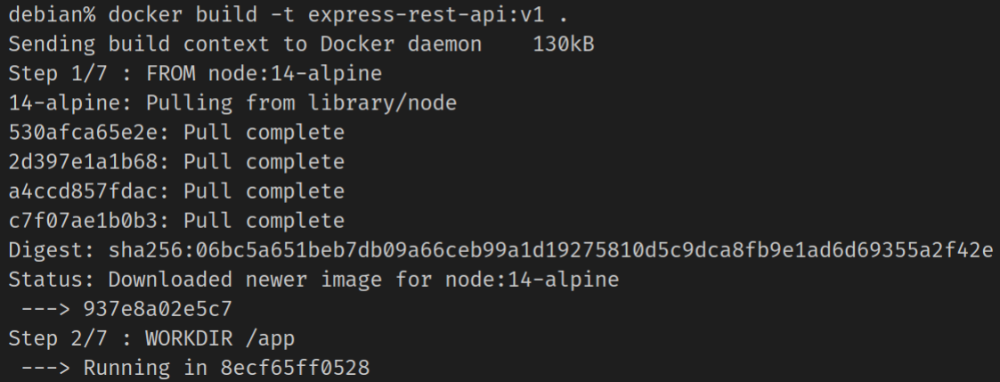
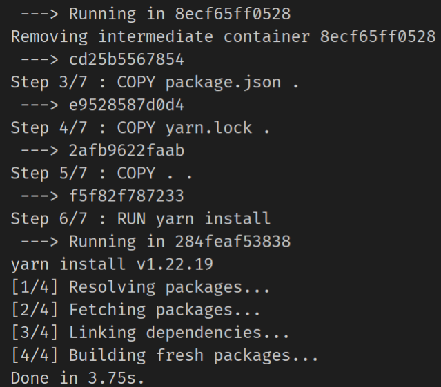
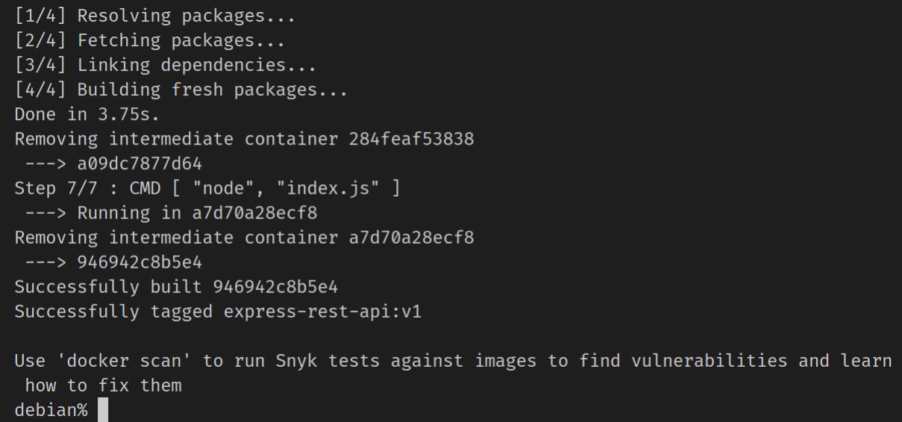

Once the image is built, we can start the container by doing the following command.

```bash
docker run -e PORT=8000 -p 7001:8000 946942c8b5e4
```

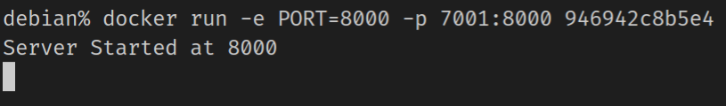

In the `index.js` file, the specified port for the server was defined as the `PORT` environment variable with the default value being 3000 if no port is specified at the environment variable. We used `-e PORT=8000` to define the port as 8000. However, this port is defined for our container which is inaccessible from our local macihine by default. Therefore, we also mapped port 7001 of our local machine to the container's port 8000. Notice that, if we haven't defined any port in our environment variable (by omitting `-e PORT=8000`) then the server would have used port 3000 by default. In that case, we would have to map the local machine's port 7001 (or any other port) to the container's port 3000 as follows:-

```bash
docker run -p 7001:3000 946942c8b5e4
```

Now, we can make some requests to our express restful api with any rest api client. We'll be using [insomnia](https://insomnia.rest/) to test our api by hitting the `http://localhost:7001` endpoint as follow:-

1. GET request to `http://localhost:7001` 

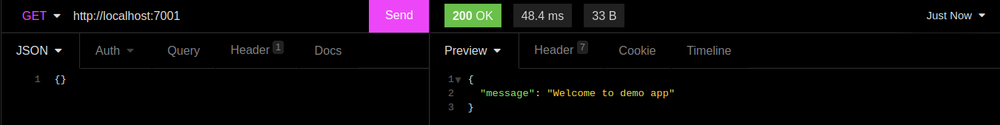

2. GET request to `http://localhost:7001/surprise`

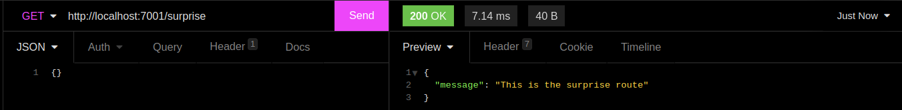

3. GET request to `http://localhost:7001/dynamic/100`

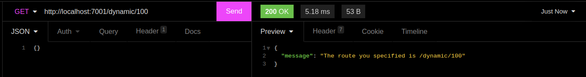

4. POST request to `http://localhost:7001/headers` with a empty body `{}`

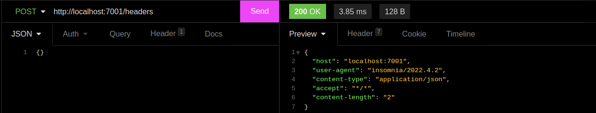

5. POST request to `http://localhost:7001/body` with the body 

```json
{
    "Hello": "World"
}
```

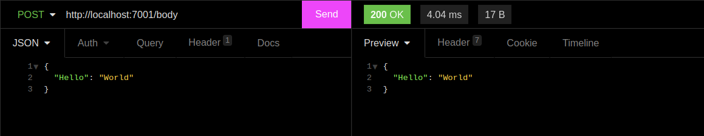

You can see a running image using the following command

```bash
docker ps
```

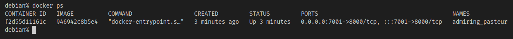

Also, to see a stopped image we need to use the following command

```bash
docker ps -a
```

Once the testing is done we can stop the container by pressing `Cltr + C` on the keyboard or using the following command

```bash
docker kill f2d55d11161c
```


Notice, it is usually preferred to use `docker stop` to stop a container as in

```bash
docker stop f2d55d11161c
```

The docker stop commands issue the SIGTERM signal which attempts to gracefully shutdown the container, whereas the docker kill commands sends the SIGKILL signal which immediately stops/terminates the container. We've used `docker kill` to stop the container as we'll be deleting the container right now as follows:-

```bash
docker rm f2d55d11161c
```

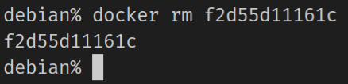

Once the container is removed we can remove the image using the following command.
Pro-tip, we can start up the container directly by just doing the following command. This will build the image and start the container.

```bash
docker compose up
```

THANKS FOR READING.